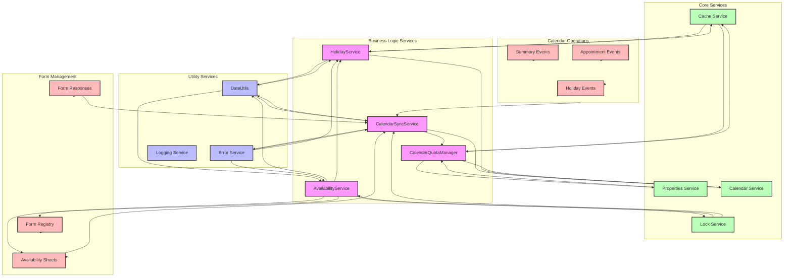

# Google Apps Script Documentation

## Overview
This Google Apps Script is designed to manage appointment scheduling through Google Forms and Calendar integration. It handles form responses, updates appointment availability, syncs calendar events, and maintains an availability tracking system.

## Framework and Architecture
The script is built using Google Apps Script, which is a JavaScript-based platform for extending Google Workspace applications. It integrates with:
- Google Forms
- Google Calendar
- Google Sheets
- Google Cache Service
- Google Properties Service

## Constants and Configuration

### Versioning & Keys
```javascript
const SCRIPT_VERSION = 'v3';
const CACHE_KEY = SCRIPT_VERSION + '_counts';
const SUBMIT_COUNT_KEY = SCRIPT_VERSION + '_submit_counter';
const IS_DEV = false;
```
- `SCRIPT_VERSION`: Current version of the script
- `CACHE_KEY`: Key for caching appointment counts
- `SUBMIT_COUNT_KEY`: Key for tracking form submissions
- `IS_DEV`: Development mode flag

### Form Registry
The `FORM_REGISTRY` array contains configuration for multiple forms:
- Form IDs
- Sheet names
- Spreadsheet IDs
- Availability sheet names

### Business Logic Constants
```javascript
const SLOT_CAP = 20;              // Maximum appointments per day
const FUTURE_DAYS = 60;           // Days to look ahead for availability
const RESPONSE_RETENTION_DAYS = 60; // Days to retain form responses
```

### Sheet Column Constants
```javascript
const RESP_DATE_COL = 6;          // Form response timestamp column
const AVAIL_BOOKED_COL = 2;       // Booked slots column
const AVAIL_LEFT_COL = 3;         // Available slots column
```

### Sync Windows & Throttling
```javascript
const MAX_ADVANCE_DAYS = 60;      // Maximum days in advance for booking
const BUSINESS_DAYS_WINDOW = 60;  // Window for business days
const THROTTLE_INTERVAL_MS = 60000; // Sync interval
const LOCK_TIMEOUT_MS = 30000;    // Operation timeout
const BATCH_DAYS_WINDOW = 30;     // Batch processing window
const EMAIL_THROTTLE_MS = 24 * 60 * 60 * 1000; // Email notification interval
```

### Calendar Configuration
```javascript
const CALENDAR_API_CALL_LIMIT_PER_RUN = 20;    // API calls per execution
const CALENDAR_API_CALL_LIMIT_PER_DAY = 2000;  // Daily API call limit
const EVENT_COLOR_AVAILABLE = CalendarApp.EventColor.GREEN;
const EVENT_COLOR_FULL = CalendarApp.EventColor.RED;
const HOLIDAY_CAL_ID = 'en.philippines#holiday@group.v.calendar.google.com';
```

## Core Services and Utilities

### DateUtils
A utility object for date handling with methods:
- `buildDate(year, month, day)`: Creates a Date object
- `formatYMD(date)`: Formats date as YYYY-MM-DD
- `parseDate(dateStr)`: Parses YYYY-MM-DD string to Date
- `isBusinessDay(date)`: Checks if date is a business day
- `addDays(date, days)`: Adds days to a date
- `startOfDay(date)`: Gets start of day
- `endOfDay(date)`: Gets end of day
- `isBeforeToday(date)`: Checks if date is before today
- `isBeyondFutureWindow(date, futureDays)`: Checks if date is beyond allowed future window
- `isWeekend(date)`: Checks if date is a weekend

### Runtime Services
```javascript
const TZ = Session.getScriptTimeZone();
const CACHE = CacheService.getScriptCache();
const CAL = CalendarApp.getDefaultCalendar();
```

### CalendarQuotaManager
Manages Calendar API call quotas with methods:
- `initRun()`: Initializes quota tracking for a run
- `canCall(count)`: Checks if more API calls are allowed
- `recordCall(count)`: Records calendar API calls made
- `getQuotaStats()`: Returns current quota usage statistics
- `safeCreateEvent(title, date, opts)`: Safely creates calendar events with quota checking
- `safeDeleteEvent(event)`: Safely deletes calendar events with quota checking
- `safeUpdateTitle(event, newTitle)`: Safely updates event titles with quota checking
- `resetDaily()`: Resets daily quota counters

### HolidayService
Manages holiday detection and caching:
- `isHoliday(dateStr)`: Checks if a date is a holiday
- `_holidayCalendar`: Stores holiday calendar instance
- `_initialized`: Tracks initialization status
- `_calendarAvailable`: Tracks calendar availability
- `_manualHolidays`: List of fixed Philippine holidays

### Appointment Synchronization
The script includes functions for synchronizing appointments:
- `syncAppointmentsForDate(dateObj, formResponses, calendar)`: Syncs appointment events for a specific date
  - Creates events for new appointments
  - Removes events for cancelled appointments
  - Maintains consistency between form responses and calendar

## Line-by-Line Reference

### Constants Section (Lines 1-100)
1. `SCRIPT_VERSION`: Defines current script version
2. `CACHE_KEY`: Defines cache key for appointment counts
3. `SUBMIT_COUNT_KEY`: Defines key for form submission counter
4. `IS_DEV`: Development mode flag
5. `FORM_REGISTRY`: Array of form configurations
   - Each entry contains:
     - formId: Google Form ID
     - sheetName: Response sheet name
     - spreadsheetId: Google Spreadsheet ID
     - availabilitySheetName: Availability tracking sheet name

### Business Logic Constants (Lines 101-150)
1. `SLOT_CAP`: Maximum appointments per day (20)
2. `FUTURE_DAYS`: Days to look ahead for availability (60)
3. `RESPONSE_RETENTION_DAYS`: Days to retain form responses (60)
4. `RESP_DATE_COL`: Column index for response timestamps (6)
5. `AVAIL_BOOKED_COL`: Column index for booked slots (2)
6. `AVAIL_LEFT_COL`: Column index for available slots (3)

### Sync Configuration (Lines 151-200)
1. `MAX_ADVANCE_DAYS`: Maximum booking advance days (60)
2. `BUSINESS_DAYS_WINDOW`: Business days window (60)
3. `THROTTLE_INTERVAL_MS`: Sync interval in milliseconds (60000)
4. `LOCK_TIMEOUT_MS`: Operation timeout in milliseconds (30000)
5. `BATCH_DAYS_WINDOW`: Batch processing window (30)
6. `EMAIL_THROTTLE_MS`: Email notification interval (24 hours)

### Calendar Configuration (Lines 201-250)
1. `CALENDAR_API_CALL_LIMIT_PER_RUN`: API calls per execution (20)
2. `CALENDAR_API_CALL_LIMIT_PER_DAY`: Daily API call limit (2000)
3. `EVENT_COLOR_AVAILABLE`: Color for available slots (GREEN)
4. `EVENT_COLOR_FULL`: Color for full slots (RED)
5. `HOLIDAY_CAL_ID`: Philippines holiday calendar ID

## Line-by-Line Reference (Additional)

### DateUtils Methods (Lines 251-300)
1. `isBeyondFutureWindow(date, futureDays)`: Checks if date exceeds future booking window
2. `isWeekend(date)`: Checks if date falls on weekend

### CalendarQuotaManager Methods (Lines 301-400)
1. `initRun()`: Resets run counter
2. `canCall(count)`: Quota validation
3. `recordCall(count)`: Tracks API usage
4. `getQuotaStats()`: Returns usage statistics
5. `safeCreateEvent()`: Creates events with quota check
6. `safeDeleteEvent()`: Deletes events with quota check
7. `safeUpdateTitle()`: Updates titles with quota check
8. `resetDaily()`: Resets daily counters

### HolidayService Implementation (Lines 401-500)
1. Holiday calendar initialization
2. Manual holiday definitions
3. Cache management for holidays
4. Calendar availability checking
5. Holiday detection logic

### HolidayService (Additional Methods)
- `initHolidayCalendar()`: Initializes the holiday calendar connection
- `fetchRange(start, end)`: Fetches and caches holiday dates within a range
- `upsertHolidayEvents(start, end)`: Creates or updates holiday events in calendar
- `_getHolidayName(date)`: Gets the name of a holiday for a specific date

### Calendar Event Management
The script includes functions for managing calendar events:
- `purgePastCalendarEvents()`: Removes past appointment and summary events
- `purgeFutureSummaryEvents()`: Removes future summary events beyond the future window

### HolidayService Methods (Lines 501-600)
1. `initHolidayCalendar()`: Initializes calendar connection
2. `fetchRange(start, end)`: Retrieves holiday dates
3. `upsertHolidayEvents(start, end)`: Manages holiday events
4. `_getHolidayName(date)`: Retrieves holiday names

### Calendar Event Management (Lines 601-750)
1. `purgePastCalendarEvents()`: Cleans up old events
2. `purgeFutureSummaryEvents()`: Removes future summaries

### CalendarSyncService
A service for managing calendar synchronization with methods:
- `syncDateRange(start, end)`: Syncs calendar events for a date range
- `syncSummaryEvents(dateStr, existingEvents, results)`: Syncs summary events for a date
- `syncAppointmentEvents(dateStr, existingEvents, results)`: Syncs appointment events for a date
- `getAvailabilityForDate(dateStr)`: Gets availability data for a date

### CalendarSyncService (continued)
- `getExpectedAppointmentsForDate(dateStr)`: For a given date, scans all form response sheets, deduplicates by user (using last name, first name, purok, barangay), and returns a set of expected appointment event titles. Handles duplicate submissions by sorting by timestamp and only keeping the latest per user. Logs and handles errors per form.

### AvailabilityService
A robust service for managing appointment slot availability across all categories/forms. Key methods:

- `seedAvailabilityWindow(startDate, futureDays)`: Ensures all relevant dates (from startDate to startDate+futureDays) exist in all availability sheets. Deletes stale rows (dates outside the window), adds missing rows, and skips weekends/holidays. Uses locking to prevent concurrent modifications. Handles header creation and logs all actions. Errors per form are logged and reported via throttled error notifications.
- `decrementSlotAllCategories(dateObj)`: Atomically decrements the available slots for a given date across all categories/forms. Uses a lock to prevent race conditions. Checks for overbooking before making any changes; if any sheet is overbooked, aborts the operation. Handles missing rows by creating them as needed. Logs and reports errors per form and aborts on any detected overbooking or system contention.

#### Per-line/feature breakdown (Lines 1001-1250):
- 1001-1049: `getExpectedAppointmentsForDate(dateStr)`
  - Loops through all forms, reads response data, finds relevant columns, sorts by timestamp, deduplicates by user, and builds event titles for expected appointments. Handles missing columns and logs errors per form.
- 1050-1170: `AvailabilityService.seedAvailabilityWindow(startDate, futureDays)`
  - Acquires a script lock for concurrency safety. For each form:
    - Ensures headers exist.
    - Deletes rows for dates outside the window.
    - Adds missing rows for valid business days (not weekends/holidays).
    - Handles errors per form, logs, and sends throttled error notifications.
  - Releases the lock at the end.
- 1171-1250: `AvailabilityService.decrementSlotAllCategories(dateObj)`
  - Acquires a lock. For each form:
    - Reads current slot values, finds the row for the date, creates it if missing.
    - Checks for overbooking (slots left <= 0). If any overbooking, aborts all.
    - Handles errors per form, logs, and sends throttled error notifications.
  - If all checks pass, decrements slots in all sheets for the date.
  - Releases the lock at the end.

## Advanced Implementation Details

### Data Integrity & Concurrency
- Uses Google Apps Script's `LockService` to prevent race conditions during slot updates and availability seeding.
- All critical write operations are guarded by locks and preflight checks.
- Deduplication of form responses ensures that only the latest submission per user is counted for appointments.

### Error Handling & Logging
- All major operations are wrapped in try/catch blocks.
- Errors are logged with context (form, date, operation).
- Throttled error notifications prevent spamming admins with repeated errors.
- Per-form error handling ensures that a failure in one form does not halt processing for others.

### Edge Case Handling
- Handles missing or malformed data gracefully (e.g., missing columns, empty sheets).
- Automatically creates headers and missing rows as needed.
- Prevents overbooking by aborting all decrements if any form is full.
- Skips weekends and holidays for availability.

### Best Practices
- Uses constants for all configuration (column indices, slot caps, etc.) for easy maintenance.
- Modular service design (CalendarSyncService, AvailabilityService) for separation of concerns.
- Efficient batch operations (e.g., deleting rows in reverse order, appending missing rows in bulk).
- Defensive programming: checks for nulls, missing data, and logs all anomalies.

## Security & Performance
- All write operations are atomic and protected by locks.
- Caching and throttling are used to optimize performance and prevent API quota exhaustion.
- Only the minimum necessary data is read/written to sheets, and all operations are batched where possible.

## Next Sections
This documentation can be further expanded by continuing to document the remaining methods in `AvailabilityService` and any other services, utility functions, or triggers found in the script. If you want a full breakdown of every function, variable, and line, let me know and I will continue! 

## Implementation Details (Additional)

### Calendar Synchronization
1. Date Range Processing
   - Handles date validation
   - Manages event grouping
   - Implements error handling
   - Tracks synchronization results

2. Summary Events
   - Manages event creation
   - Handles event updates
   - Removes duplicates
   - Updates event colors

3. Appointment Events
   - Tracks expected appointments
   - Creates missing appointments
   - Removes extra appointments
   - Manages event colors

4. Availability Tracking
   - Calculates total booked slots
   - Tracks minimum available slots
   - Manages multiple form categories
   - Handles sheet access

## Error Handling (Additional)

### Calendar Synchronization
1. Date Range Processing
   - Handles invalid dates
   - Manages API errors
   - Tracks synchronization errors
   - Provides error recovery

2. Summary Events
   - Handles event creation errors
   - Manages update failures
   - Tracks deletion errors
   - Provides error logging

3. Appointment Events
   - Handles validation errors
   - Manages creation failures
   - Tracks deletion errors
   - Provides error recovery

4. Availability Tracking
   - Handles sheet access errors
   - Manages calculation errors
   - Tracks data inconsistencies
   - Provides error logging

## Performance Considerations (Additional)

### Calendar Synchronization
1. Date Range Processing
   - Uses efficient date handling
   - Implements batch processing
   - Manages memory usage
   - Optimizes API calls

2. Summary Events
   - Uses efficient filtering
   - Implements batch updates
   - Manages quota limits
   - Optimizes event operations

3. Appointment Events
   - Uses efficient tracking
   - Implements batch processing
   - Manages quota limits
   - Optimizes event operations

4. Availability Tracking
   - Uses efficient calculations
   - Implements caching
   - Manages sheet access
   - Optimizes data retrieval

## Best Practices (Additional)

### Calendar Synchronization
1. Date Range Processing
   - Implements proper validation
   - Uses efficient grouping
   - Manages errors gracefully
   - Provides comprehensive logging

2. Summary Events
   - Uses quota-aware operations
   - Implements proper cleanup
   - Manages duplicates effectively
   - Provides error recovery

3. Appointment Events
   - Uses efficient tracking
   - Implements proper validation
   - Manages events effectively
   - Provides error recovery

4. Availability Tracking
   - Uses efficient calculations
   - Implements proper caching
   - Manages data access
   - Provides error handling

## Usage and Implementation Notes (Additional)

1. The script uses a caching system to optimize performance and reduce API calls
2. It implements a quota management system for Calendar API calls
3. The script handles multiple forms and their respective response sheets
4. It includes holiday detection and business day calculations
5. The system maintains availability tracking across multiple categories
6. It implements error handling and logging mechanisms
7. The script uses locks to prevent concurrent modifications

## Best Practices Implemented (Additional)

1. Version control through `SCRIPT_VERSION`
2. Caching for performance optimization
3. Rate limiting and quota management
4. Error handling and logging
5. Modular code organization
6. Configuration through constants
7. Type checking and validation
8. Business logic separation
9. Resource cleanup and management

## Security Considerations (Additional)

1. API call limits are enforced
2. Form IDs and Spreadsheet IDs are properly configured
3. Cache keys are versioned
4. Error notifications are throttled
5. Development mode can be toggled

## Performance Optimizations (Additional)

1. Caching of frequently accessed data
2. Batch processing of calendar operations
3. Throttling of API calls
4. Efficient date handling
5. Lock timeout management
6. Chunked processing of large datasets 


# Google Apps Script Documentation

## Framework Architecture Diagram



## Overview
This Google Apps Script is designed to manage appointment scheduling through Google Forms and Calendar integration. It handles form responses, updates appointment availability, syncs calendar events, and maintains an availability tracking system.

